# HC.TechnicalCalculators Architecture Diagram

```mermaid
graph TB
    %% External Dependencies
    subgraph "External Dependencies"
        TALib["TALib.NETCore<br/>Technical Analysis Library"]
        MSExt["Microsoft.Extensions<br/>(DI, Logging, HTTP, Options)"]
        HCCommon["HC.Common<br/>Base Library"]
    end

    %% Client Layer
    subgraph "Client Layer"
        Client["Client Application"]
        DI["Dependency Injection<br/>Container"]
    end

    %% Extensions & Configuration
    subgraph "Extensions & DI Setup"
        ServiceExt["ServiceCollectionExtensions<br/>AddTechnicalCalculators()"]
        CalcStartup["CalculatorStartup<br/>Configuration"]
    end

    %% Factory Layer
    subgraph "Factory Layer"
        CalcFactory["CalculatorFactory<br/>(Static Factory)"]
        CalcEnum["CalculatorNameEnum<br/>(ADX, RSI, SMA, etc.)"]
    end

    %% Core Interfaces
    subgraph "Core Interfaces"
        ITechCalc["ITechnicalCalculator<br/>Calculate()"]
        INewsFeed["INewsFeedService<br/>GetNewsForSymbol()"]
        IInputVal["IInputValidationService<br/>ValidateInput()"]
        ISecureData["ISecureDataService<br/>ProtectData()"]
    end

    %% Base Calculator
    subgraph "Base Layer"
        BaseCalc["BaseCalculator<br/>(Abstract)<br/>- Price parsing<br/>- Validation<br/>- TALib integration"]
    end

    %% Calculator Categories
    subgraph "Calculator Categories"
        subgraph "Momentum Calculators"
            ADX["AdxCalculator"]
            RSI["RsiCalculator"]
            MACD["MacdCalculator"]
            STOCH["StochCalculator"]
            MOM["MomCalculator"]
            Others1["... others"]
        end

        subgraph "Overlap Calculators"
            SMA["SimpleMovingAverage"]
            EMA["ExponentialMovingAverage"]
            BBANDS["BollingerBandsCalculator"]
            KAMA["KaufmanAdaptiveMA"]
            Others2["... others"]
        end

        subgraph "Volume Calculators"
            OBV["ObvCalculator"]
            CHAIKIN["ChaikinAdLineCalculator"]
            MFI["MfiCalculator"]
            Others3["... others"]
        end

        subgraph "Volatility Calculators"
            ATR["AtrCalculator"]
            NATR["NatrCalculator"]
            TRANGE["TrangeCalculator"]
            Others4["... others"]
        end

        subgraph "Price Calculators"
            AVGPRICE["AvgPriceCalculator"]
            WCLPRICE["WclPriceCalculator"]
            Others5["... others"]
        end

        subgraph "Statistics Calculators"
            BETA["BetaCalculator"]
            Others6["... others"]
        end

        subgraph "News Calculators"
            NEWS["NewsSentimentCalculator"]
        end
    end

    %% Security Layer
    subgraph "Security Layer"
        InputVal["InputValidationService<br/>- Array size validation<br/>- Parameter validation<br/>- Symbol validation"]
        SecureData["SecureDataService<br/>- Data protection<br/>- Encryption"]
        SecureHttp["SecureHttpClientFactory<br/>- Secure HTTP clients"]
        SecureOptions["SecureNewsFeedOptions<br/>- Configuration"]
    end

    %% Services Layer
    subgraph "Services Layer"
        NewsFeedSvc["NewsFeedService<br/>- News retrieval<br/>- Sentiment analysis<br/>- Rate limiting<br/>- Caching"]
    end

    %% Models Layer
    subgraph "Models Layer"
        CalcResults["CalculatorResults<br/>Output data"]
        NewsItem["NewsItem<br/>News data model"]
        ParamNames["ParameterNamesEnum"]
        TechNames["TechnicalNamesEnum"]
        ParamValueType["ParameterValueTypeEnum"]
    end

    %% Data Flow Connections
    Client --> ServiceExt
    ServiceExt --> DI
    DI --> CalcFactory
    DI --> NewsFeedSvc
    DI --> InputVal
    DI --> SecureData
    DI --> SecureHttp

    CalcFactory --> CalcEnum
    CalcFactory --> ITechCalc
    CalcFactory --> IInputVal

    %% Calculator Inheritance
    BaseCalc --> ADX
    BaseCalc --> RSI
    BaseCalc --> MACD
    BaseCalc --> STOCH
    BaseCalc --> MOM
    BaseCalc --> SMA
    BaseCalc --> EMA
    BaseCalc --> BBANDS
    BaseCalc --> KAMA
    BaseCalc --> OBV
    BaseCalc --> CHAIKIN
    BaseCalc --> MFI
    BaseCalc --> ATR
    BaseCalc --> NATR
    BaseCalc --> TRANGE
    BaseCalc --> AVGPRICE
    BaseCalc --> WCLPRICE
    BaseCalc --> BETA
    BaseCalc --> NEWS

    %% Interface Implementations
    BaseCalc -.-> ITechCalc
    NewsFeedSvc -.-> INewsFeed
    InputVal -.-> IInputVal
    SecureData -.-> ISecureData

    %% Dependencies
    BaseCalc --> TALib
    BaseCalc --> IInputVal
    NewsFeedSvc --> ISecureData
    NewsFeedSvc --> SecureHttp
    NewsFeedSvc --> SecureOptions
    NEWS --> INewsFeed

    %% Model Usage
    BaseCalc --> CalcResults
    NewsFeedSvc --> NewsItem
    CalcFactory --> ParamNames
    CalcFactory --> TechNames
    CalcFactory --> ParamValueType

    %% External Dependencies
    BaseCalc --> MSExt
    ServiceExt --> MSExt
    NewsFeedSvc --> MSExt
    InputVal --> MSExt
    SecureData --> MSExt

    %% Styling
    classDef interface fill:#e1f5fe
    classDef abstract fill:#fff3e0
    classDef concrete fill:#e8f5e8
    classDef security fill:#ffebee
    classDef external fill:#f3e5f5
    classDef model fill:#fff8e1

    class ITechCalc,INewsFeed,IInputVal,ISecureData interface
    class BaseCalc abstract
    class CalcFactory,ServiceExt concrete
    class InputVal,SecureData,SecureHttp,NewsFeedSvc security
    class TALib,MSExt,HCCommon external
    class CalcResults,NewsItem,ParamNames,TechNames,ParamValueType model
```

## Architecture Overview

### Key Components:

1. **Factory Pattern**: `CalculatorFactory` creates calculator instances based on `CalculatorNameEnum`
2. **Inheritance Hierarchy**: All calculators inherit from `BaseCalculator` which implements `ITechnicalCalculator`
3. **Dependency Injection**: Configured through `ServiceCollectionExtensions` for easy integration
4. **Security Layer**: Comprehensive input validation, data protection, and secure HTTP clients
5. **Categorized Calculators**: Organized by type (Momentum, Overlap, Volume, etc.)
6. **TALib Integration**: Uses TALib.NETCore for technical analysis calculations
7. **News Integration**: Supports news sentiment analysis with caching and rate limiting

### Security Features:
- Input validation for all parameters and price data
- Secure data handling and encryption
- Rate limiting for external API calls
- Protected configuration options

### Extensibility:
- Easy to add new calculator types through the factory pattern
- Consistent interface for all calculators
- Modular design with clear separation of concerns